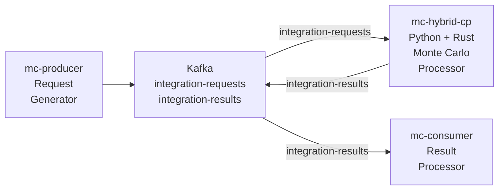

# Kafka Monte Carlo Integration System

A distributed Monte Carlo integration system built with Apache Kafka, Python, and Rust. This microservices template demonstrates high-performance numerical computing using a producer-consumer architecture with hybrid Python-Rust processing.

## Architecture Overview

The system consists of four main components:

1. **Apache Kafka Infrastructure** - Message broker for distributed task processing
2. **Producer Service** (`mc-producer`) - Generates Monte Carlo integration requests
3. **Hybrid Consumer-Producer** (`mc-hybrid-consumer-producer`) - Python service with Rust computational core
4. **Consumer Service** (`mc-consumer`) - Processes and logs integration results





## Quick Start

### 1. Start Kafka Infrastructure

```bash
# Start Kafka, Zookeeper, and Redpanda Console
docker-compose up -d

# Verify services are running
docker-compose ps
```
Access Redpanda Console at http://localhost:8080 to monitor topics and messages.

### 2. Build and Run Services

#### Producer Service
```bash
cd mc-producer
docker compose up -d --build --scale mc-producer
```

#### Hybrid Consumer-Producer (Main Processor)
```bash
cd mc-hybrid-consumer-producer
docker compose up -d --build --scale mc-hybrid-consumer-producer=3
```

#### Result Consumer
```bash
cd mc-consumer
docker compose up -d --build --scale mc-consumer=3
```

### 3. Monitor the System

- **Kafka Topics**: http://localhost:8080
- **Container logs**: `docker logs <container-name>`
- **System status**: `docker-compose ps`

## System Flow

1. **Request Generation**: The producer generates integration requests with random function configurations
2. **Task Distribution**: Requests are sent to the `integration-requests` Kafka topic
3. **Processing**: The hybrid consumer picks up requests and processes them using Rust's parallel Monte Carlo implementation
4. **Result Publishing**: Computed results are published to the `integration-results` topic
5. **Result Consumption**: The consumer processes and logs the final results

## Configuration

### Kafka Settings
- **Broker**: `kafka:29092`
- **Request Topic**: `integration-requests`
- **Result Topic**: `integration-results`
- **Consumer Group**: `mc-python-processor-group`

3. **Update the producer** to include your new function configuration.

## Performance Considerations

- **Sample Count**: Higher sample counts increase accuracy but require more computation time
- **Parallelism**: Rust implementation uses Rayon for automatic parallelization
- **Memory Usage**: Large sample counts may require significant memory
- **Kafka Throughput**: Adjust batch sizes and linger times for optimal throughput

## Scaling

### Horizontal Scaling
- Run multiple instances of `mc-hybrid-consumer-producer` for parallel processing
- Kafka consumer groups automatically distribute load across instances

### Vertical Scaling
- Increase container resource limits
- Adjust `num_samples` based on available compute resources

## Redpanda Console Features
- Topic message inspection
- Consumer group monitoring
- Partition distribution
- Message throughput visualization